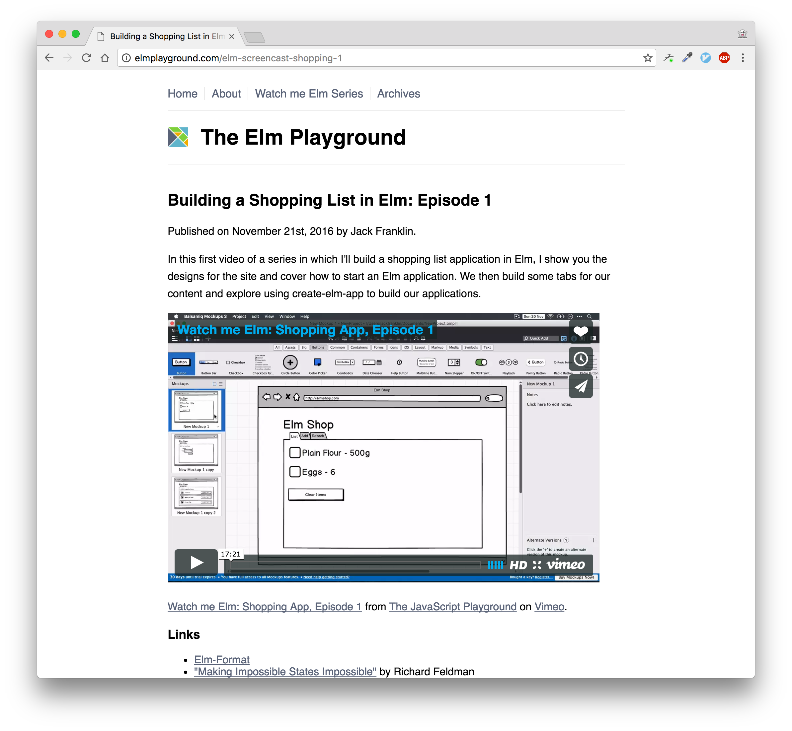

# Elm 0.18!

---

## Let's get the little things out the way first...

---

```elm
[1..5] --before

List.range 1 5 --after
```

---

```elm
-- before
let
    foo' = { foo | x = 1 }
in
  (foo', foo)
```

```elm
-- after
let
    foo_ = { foo | x = 1 }
in
  (foo_, foo)
```

---

## Tuple changes

```elm
-- before
fst (1, 2) => 1
snd (1, 2) => 2

-- after
Tuple.first (1, 2) => 1
Tuple.second (1, 2) => 2
```

---

## No more `Html.App`

```elm
-- before
Html.App.program {...}

-- after
Html.program {...}
```

---

## Task changes

`Task.perform failureFn successFn someTask` is no more.

---

For tasks that can never fail (getting current time)

```elm
Task.perform : (a -> msg) -> Task Never a -> Cmd Msg
```

---

For tasks that can fail (e.g, most of them):

```elm
-- before
Task.perform: (x -> msg) -> (a -> msg) -> Task x a -> Cmd Msg

-- after
Task.attempt: (Result x a -> msg) -> Task x a -> Cmd Msg
```

---

## No more backticks

```elm
-- before
String.toInt "1234" `Result.andThen` (\year -> isValidYear year)

-- after
String.toInt "1234" |> Result.andThen (\year -> isValidYear year)
```

---

## Live code!

---


# Upgrade process

## 1. Install `elm-format` and `elm-upgrade`

- github.com/avh4/elm-format
- github.com/avh4/elm-upgrade

## 2. Go into Elm 0.17 project and run `elm-upgrade`
## 3. Follow any compiler errors

---

# HTTP tip!

To avoid rewriting long HTTP chains with the new HTTP library, you can use `Http.toTask`.

---

# create-elm-app

Is the best way to get an Elm app up and running.

(quick demo if I have enough time and everyone isn't fed up...)

---

# Closing Remarks

0.17 -> 0.18 is much nicer than 0.16 -> 0.17.

---



```elm
details : List String
details =
  [ "elmplayground.com"
  , "javascriptplayground.com"
  , "@Jack_Franklin"
  ]
```

